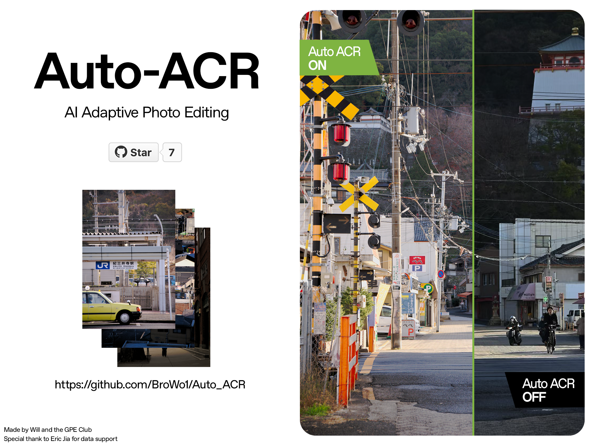

# Auto ACR Autopilot



Auto ACR Autopilot is a production-ready helper for photographers and imaging pipelines that want Lightroom/Camera Raw quality edits without living inside Adobe tooling. It predicts Adobe Camera Raw (ACR) sliders and tone curves from RAW previews, applies them via a differentiable edit layer, and writes back TIFF or sRGB previews with full EXIF metadata preserved. The repo is organised around three practical workflows: use the published checkpoints, fine-tune the model with LoRA adapters, or rebuild everything from raw assets when you need a bespoke style.

## Project Overview

Auto ACR pairs two subsystems:
- **AutoPilotRegressor** – a timm-powered vision backbone with dedicated heads for sliders and tone curves. It consumes preview-sized RGB and optionally LoRA adapters to personalise behaviour.
- **Differentiable edit layer** – a physics-inspired pipeline that applies predicted sliders in linear ProPhoto space, enabling both TIFF renders and a training-time image loss.

Auto ACR supports three stages: (1) parameter fitting on RAW/TIFF pairs, (2) model training or lightweight fine-tuning, and (3) inference/export where predictions are re-embedded with EXIF metadata for downstream tools.

## WebUI Quick Start

Run the helper script which will help you set up a conda or virtualenv environment (creating or updating it as needed) and then open the Gradio UI:

```bash
python launch_gradio.py
```

On macOS or Linux, you can use the shell wrapper (it provisions a virtualenv beside the repo):

```bash
./launch_gradio.sh
```

On Windows, the bundled batch file mirrors the same workflow with a virtualenv:

```bat
launch_gradio.bat
```

Or run the below python script after configurated the environment:

```bash
python run/gradio_app.py
```

Before launching the UI, pull down the base checkpoint and one of the published sample LoRA adapters from Hugging Face:

```bash
huggingface-cli download Willlllllllllll/Auto_ACR_base Auto_ACR_base_v0.2.pt --local-dir run
huggingface-cli download Willlllllllllll/Auto_ACR_base lora/Lora_Sample_v0.3.pt --local-dir run/lora
```

Upload a `.dng` file, pick the base checkpoint (and optional LoRA adapter), and choose whether to export a ProPhoto TIFF or sRGB JPEG. You can either select bundled weights from the dropdowns or upload your own `.pt` checkpoints directly. The interface shows the predicted sliders, the input preview, and a rendered preview with a download link to the full-resolution output.

## Project Setup

1. **Install dependencies**
   ```bash
   conda env create -f environment.yml
   conda activate auto_acr
   ```
   or
   ```bash
   python -m venv .venv
   source .venv/bin/activate
   pip install -r requirements.txt
   ```

2. **Download the base checkpoint** from Hugging Face:
   ```bash
   huggingface-cli download Willlllllllllll/Auto_ACR_base Auto_ACR_base_v0.2.pt --local-dir run
   ```
   This repo also publishes LoRA adapters at the same URL (see the `lora/` subfolder).

3. **Predict sliders (plus optional preview/XMP) for a RAW file**
   ```bash
   python run/inference.py \
     --checkpoint run/Auto_ACR_base_v0.2.pt \
     --input path/to/image.dng \
     --output outputs/predictions \
     --export-json \
     --export-preview
   ```

4. **Render an edited TIFF or JPEG preview** using the same checkpoint:
   ```bash
   python run/predict_and_render.py \
     --checkpoint run/Auto_ACR_base_v0.2.pt \
     --input path/to/image.dng \
     --output outputs/rendered \
     --srgb-output
   ```
   The `--srgb-output` flag saves a JPEG preview in `outputs/rendered/srgb/` and preserves the source DNG EXIF/metadata in both JPEG and TIFF outputs. Add `--lora-checkpoint path/to/adapter.pt` to personalize the base model with one of the published LoRA weights.


## Working With LoRA Fine-Tunes

LoRA adapters from [Willlllllllllll/Auto_ACR_base](https://huggingface.co/Willlllllllllll/Auto_ACR_base) drop in without retraining:

- **Apply during inference**
  ```bash
  python run/predict_and_render.py \
    --checkpoint run/Auto_ACR_base_v0.2.pt \
    --lora-checkpoint run/lora/Lora_Sample_v0.3.pt \
    --input path/to/image.dng \
    --output outputs/rendered \
    --srgb-output
  ```

**Preparing a fine-tune dataset**
- Assemble 20–40 (more is better) closely matched edits from a single camera/look so the adapter learns a coherent style. Each sample must contain the untouched RAW `.dng` and a manually graded ProPhoto-linear, 16-bit `.tif` export with matching filenames.
- Use `scripts/dng_tif_to_json.py` to fit ACR parameters and build a manifest in place:
  ```bash
  python scripts/dng_tif_to_json.py \
    --raw /path/to/raw_dngs \
    --tif /path/to/prophoto_tiffs \
    --out-json outputs/params \
    --out-raw-preview outputs/previews/raw \
    --out-edited-preview outputs/previews/edited \
    --manifest outputs \
    --split training \
    --expert custom_style
  ```
  This produces `outputs/style_manifest.jsonl` alongside per-image parameter JSON. Point `run/lora_finetune.py` at that manifest for training.

**Reference hyperparameters**
```bash
python -m run.lora_finetune \
  --manifest outputs/style_manifest.jsonl \
  --checkpoint run/checkpoint_epoch019.pt \
  --output outputs/lora_style \
  --train-split training \
  --epochs 20 \
  --batch-size 8 \
  --lora-rank 16 \
  --lora-alpha 32 \
  --lr 1e-3 \
  --imagenet-norm \
  --no-augment \
```

## End-to-End Workflow (Optional)

If you want to rebuild the dataset or train from scratch, follow these steps:

1. **Download the MIT-Adobe FiveK assets**
   ```bash
   python download_fivek_editor.py \
     --root /path/to/data \
     --splits train val \
     --experts c
   ```
   Supply `--dataset-repo` if you cloned a compatible `mit-adobe-fivek-dataset` repository elsewhere.
   Change `--experts` to your prefered expert (a - e) to download. 

2. **Fit ACR sliders and tone curves**
   ```bash
   python scripts/fivek_tif_to_xmp.py \
     --root /path/to/data/MITAboveFiveK \
     --split training \
     --expert c \
     --device auto \
     --steps 800
   ```
   Outputs land in `outputs/preview`, `outputs/data`, `outputs/xmps`, and the consolidated `outputs/dataset_manifest.jsonl`.

3. **Train the regressor**
   ```bash
   python run/train_autopilot.py \
     --manifest outputs/dataset_manifest.jsonl \
     --train-split training \
     --val-split validation \
     --epochs 20 \
     --batch-size 12 \
     --device auto \
     --use-edit-layer \
     --image-loss-weight 0.7 \
     --edit-resolution 512
   ```
   Checkpoints are written to `run/checkpoints/` (`best.pt` is the recommended export).

## Handy Scripts and Assets

- `scripts/apply_lut`: Apply fitted parameter JSON or a `.cube` LUT to a RAW and export an sRGB preview.
- `scripts/dng_tif_to_json.py`: Fit parameters for any RAW/TIFF pair outside the FiveK tree.
- `scripts/convert_tiff_to_prophoto.py`: Convert gamma-encoded TIFFs to linear ProPhoto TIFFs.
- `ProPhoto.icm`: Repository copy of the linear ProPhoto profile. Provide `--icc-profile` if you keep it elsewhere.

## Contributions
Will from GPE Club

<will@gpeclub.com>
